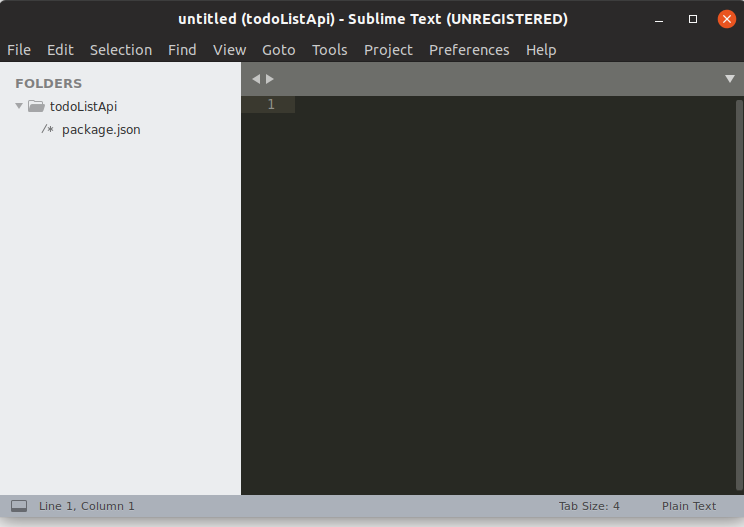
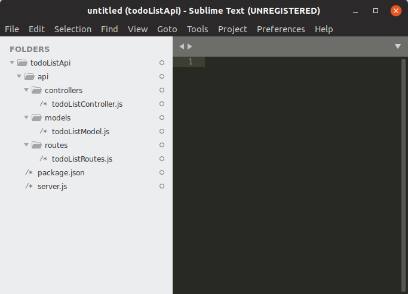
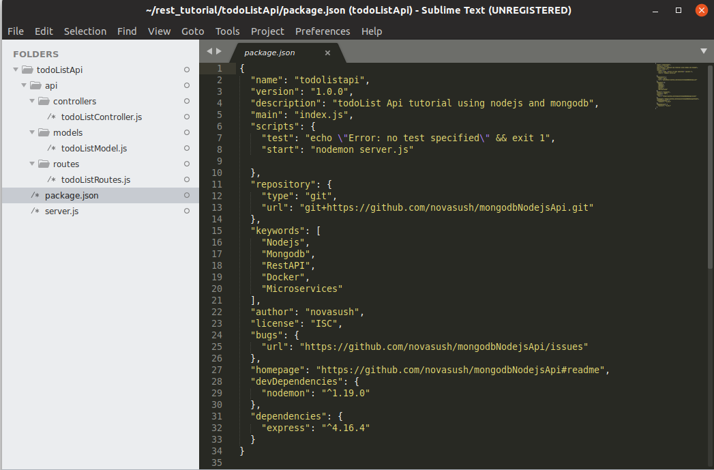
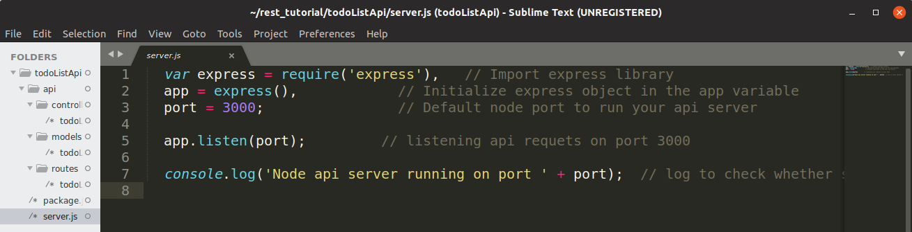
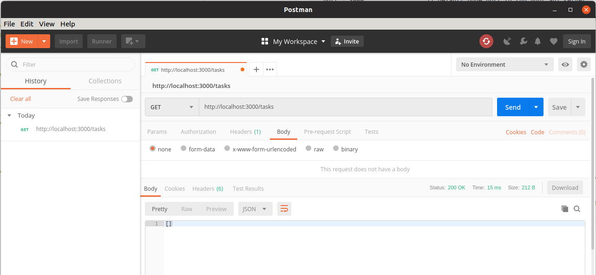
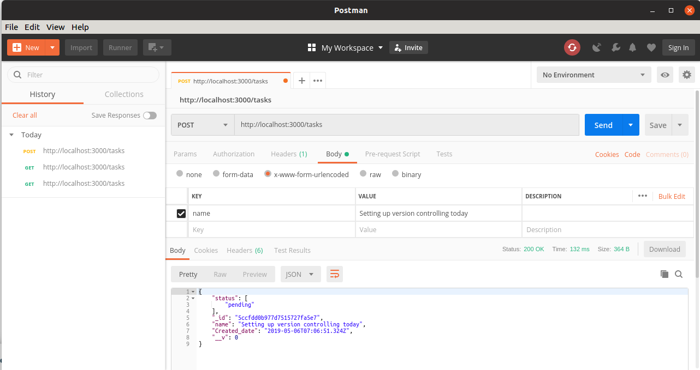
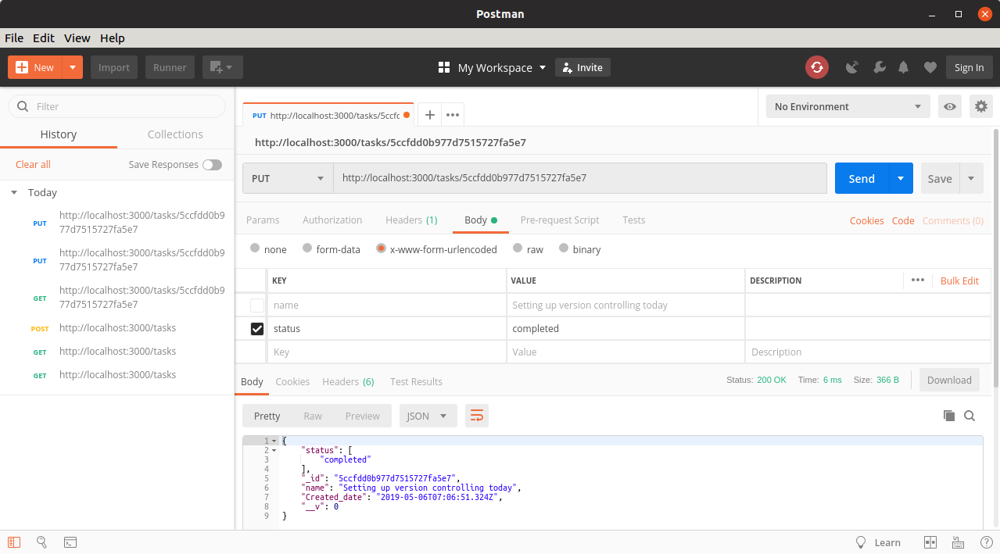

# How to write containerised api using Node.js, MongoDB and Docker

## About REST API

**What is REST**

[REST](https://www.codecademy.com/articles/what-is-rest) or **RE** presentational **S** tate **T** ransfer, is an architectural style for providing standards between computer systems on the web, making it easier for systems to communicate with each other. REST-compliant systems, often called RESTful systems, are characterized by how they are stateless and separate the concerns of client and server. We will go into what these terms mean and why they are beneficial characteristics for services on the Web.

**CRUD Applications**

RESTful applications use HTTP requests to perform four operations termed as CRUD (C: create, R: read, U: update, and D: delete). Create and/or update is used to post data, get for reading/listing data, and delete to remove data.

REST API is json rendered over following HTTP requests:
  1. List View
    * GET - To fetch all the data in the given endpoint
    * POST - To create a new entry and submit
  2. Detail View
    * GET - Fetch single entry persent on the submitted id
    * PUT - Alter the entry present on the id
    * DELETE - Delete the entry present on the id


**In this tutorial, we will learn how to create a RESTful API using Node.js.**

## Tools:
  * Node.js
  * MongoDB
  * Docker
  * Text editor (I prefer SubLime)
  * Postman (Tool for testing API)

## Prerequisite
This guide assumes that you are using Ubuntu. Before you begin, you should have a non-root user account with **sudo** privileges set up on your system, however if you are using any other operating system you will need to setup **Node.js**, **MongoDB** and **Docker** before proceeding with this tutorial.

# Getting started

For the purpose of this tutorial, I’ll work you through creating a RESTful API.

To achieve this, we will create a [RESTful todo list API](https://nsemble@bitbucket.org/nsemble/restfulapitutorial.git) (i.e. endpoints that will create a task, get or read list of all tasks, read a particular task, delete a task, and update a task).

## Installation

### Installing Node.js
Install the Distro-Stable Version for Ubuntu
1. In order to get this version, we just have to use the apt package manager. We should refresh our local package index first, and then install from the repositories:
```
$ sudo apt-get update
$ sudo apt-get install nodejs
```
2. If the package in the repositories suits your needs, this is all you need to do to get set up with Node.js. In most cases, you'll also want to also install npm, which is the Node.js package manager. You can do this by typing:
```
$ sudo apt-get install npm
```
This will allow you to easily install modules and packages to use with Node.js.

To check which version of Node.js you have installed after these initial steps, type:
```
nodejs -v
```
```
Output
v10.15.2
```

### Installing MongoDB
**Platform Support**

MongoDB only provides packages for the following 64-bit LTS (long-term support) Ubuntu releases:

   * 14.04 LTS (trusty)
   * 16.04 LTS (xenial)
   * 18.04 LTS (bionic)

See [Supported Platforms](https://docs.mongodb.com/manual/installation/#mongodb-supported-platforms) for more information.

* **Installation**

  1. Import the public key used by the package management system.
  ```
  sudo apt-key adv --keyserver hkp://keyserver.ubuntu.com:80 --recv 9DA31620334BD75D9DCB49F368818C72E52529D4
  ```
  2. Create a list file for MongoDB.
    * For **Ubuntu 18.04 (Bionic)**
    ```
    echo "deb [ arch=amd64 ] https://repo.mongodb.org/apt/ubuntu bionic/mongodb-org/4.0 multiverse" | sudo tee /etc/apt/sources.list.d/mongodb-org-4.0.list
    ```
    * For **Ubuntu 16.04 (Xenial)**
    ```
    echo "deb [ arch=amd64,arm64 ] https://repo.mongodb.org/apt/ubuntu xenial/mongodb-org/4.0 multiverse" | sudo tee /etc/apt/sources.list.d/mongodb-org-4.0.list
    ```
    * For **Ubuntu 14.04 (Trusty)**
    ```
    echo "deb [ arch=amd64 ] https://repo.mongodb.org/apt/ubuntu trusty/mongodb-org/4.0 multiverse" | sudo tee /etc/apt/sources.list.d/mongodb-org-4.0.list
    ```

  3. Reload local package database.

    Issue the following command to reload the local package database.
    ```
    sudo apt-get update
    ```
  4. Install the MongoDB packages.

    You can install either the latest stable version of MongoDB or a specific version of MongoDB.

    **Install latest release**
    ```
    sudo apt-get install -y mongodb-org
    ```
    **Install a specific release of MongoDB.**
    ```
    sudo apt-get install -y mongodb-org=4.0.9 mongodb-org-server=4.0.9 mongodb-org-shell=4.0.9 mongodb-org-mongos=4.0.9 mongodb-org-tools=4.0.9
    ```
    If you only install mongodb-org=4.0.9 and do not include the component packages, the latest version of each MongoDB package will be installed regardless of what version you specified.

* **Run MongoDB Community Edition**
  1. Start MongoDB.

    Issue the following command to start mongod:
    ```
    sudo service mongod start
    ```
  2. Verify that MongoDB has started successfully

    Verify that the mongod process has started successfully by checking the contents of the log file at /var/log/mongodb/mongod.log for a line reading
    ```
    sudo cat /var/log/mongodb/mongod.log | grep port
    ```
    **27017** is the default port the standalone mongod listens on.

### Installing Docker and Docker Compose
#### Install Docker
1. Uninstall old versions
   Older versions of Docker were called docker, docker.io , or docker-engine.
   If these are installed, uninstall them:

   ```
   sudo apt-get remove docker docker-engine docker.io containerd runc
   ```

2. Update the apt package index:

  ```
  sudo apt-get update
  ```

3. Install packages to allow apt to use a repository over HTTPS:

  ```
  sudo apt-get install \
    apt-transport-https \
    ca-certificates \
    curl \
    gnupg-agent \
    software-properties-common
  ```

4. Add Docker’s official GPG key:

  ```
  curl -fsSL https://download.docker.com/linux/ubuntu/gpg | sudo apt-key add -
  ```

5. Verify that you now have the key with the fingerprint 9DC8 5822 9FC7 DD38 854A E2D8 8D81 803C  0EBF CD88, by searching for the last 8 characters of the fingerprint.

  ```
  sudo apt-key fingerprint 0EBFCD88
  ```

6. Add apt repository \\\

  ```
  sudo add-apt-repository \
   "deb [arch=amd64] https://download.docker.com/linux/ubuntu \
   $(lsb_release -cs) \
   stable"
  ```

  or

  ```
  sudo add-apt-repository \
    "deb [arch=amd64] https://download.docker.com/linux/ubuntu \
    bionic test"
  ```

7. Once again update apt package:

  ```
  sudo apt-get update
  ```

8. Install the latest version of Docker CE and containerd, or go to the next step to install a specific version:

  ```
  sudo apt-get install docker-ce docker-ce-cli containerd.io
  ```

9. Verify that Docker CE is installed correctly by running the hello-world image.

  ```
  sudo docker run hello-world
  ```
* If you would like to use Docker as a non-root user, you should now consider adding your user to the “docker” group with something like:

  ```
  sudo usermod -aG docker <your-user>
  ```

#### Install Docker Compose

  1. Run this command to download the current stable release of Docker Compose:
    ```
    sudo curl -L "https://github.com/docker/compose/releases/download/1.24.0/docker-compose-$(uname -s)-$(uname -m)" -o /usr/local/bin/docker-compose
    ```
  2. Apply executable permissions to the binary:
   ```
   sudo chmod +x /usr/local/bin/docker-compose
   ```
  3. Test the installation.
   ```
    docker-compose --version
   ```


## Tutorial

### 1. Development
#### 1.1 Setting up files and directory
  1. Open your terminal and kindly follow the following steps.
  ```
  mkdir todoListApi && cd todoListApi
  ```
  2. Create a package.json file.
  ```
  npm init
  ```
  **Package.json** is a file that gives the necessary information to npm which allows it to identify the project as well as handle the project's dependencies.
  npm init will prompt you to enter some information such as the app name, description, version, author, keyword and also ask if what you see is what you like.

  You should have something like this eventually.
  ```
  {
  "name": "todolistapi",
  "version": "1.0.0",
  "description": "todoList Api tutorial using nodejs and mongodb",
  "main": "index.js",
  "scripts": {
    "test": "echo \"Error: no test specified\" && exit 1"
  },
  "repository": {
    "type": "git",
    "url": "git+https://github.com/novasush/mongodbNodejsApi.git"
  },
  "keywords": [
    "Nodejs",
    "Mongodb",
    "RestAPI",
    "Docker",
    "Microservices"
  ],
  "author": "novasush",
  "license": "ISC",
  "bugs": {
    "url": "https://github.com/novasush/mongodbNodejsApi/issues"
  },
  "homepage": "https://github.com/novasush/mongodbNodejsApi#readme"
  }

  Is this OK? (yes)
  ```
  Kindly type yes and press enter to complete the creation of our package.json. Having done all these, your folder structure should look like this:

  

  3. Create a file called server.js
  ```
  touch server.js
  ```
  4. Create folder called api including three separate subfolders called models, routes, and controllers
  ```
  mkdir api api/controllers api/models api/routes
  ```
  5. Create todoListController.js in the api/controller folder, todoListRoutes.js in the routes folder, and todoListModel in the model folder.
  ```
  touch api/controllers/todoListController.js api/models/todoListModel.js api/routes/todoListRoutes.js
  ```
  Our directory structure should look like this now:

  


#### 1.2 Server Setup
  Let's install express and nodmon, express will be used to create the server while nodmon will help us to keep track of changes to our application by watching changed files and automatically restart the server.
  ```
  npm install --save-dev nodemon

  npm install express --save
  ```
  On successful installation, your package.json file will be modified to have the two newly installed packages.

  1. Open the package.json file and add this task to the script
  ```
  "start": "nodemon server.js"
  ```
  After modification your package.json should look like this:

  

  2. Open the server.js file and type the code below into it.
  ```
  var express = require('express'),   // Import express library
  app = express(),            // Initialize express object in the app variable
  port = 3000;                // Default node port to run your api server

  app.listen(port);         // listening api requets on port 3000

  console.log('Node api server running on port ' + port);  // log to check whether server running or not
  ```

  

  3. On your terminal, run `npm run start` this will start the server and then you will see
  ```
  > todolistapi@1.0.0 start /home/sush/rest_tutorial/todoListApi
  > nodemon server.js

  [nodemon] 1.19.0
  [nodemon] to restart at any time, enter `rs`
  [nodemon] watching: *.*
  [nodemon] starting `node server.js`
  Node api server running on port 3000
  ```

#### 1.3 Schema Setup
  First of all, let’s install mongoose -
  ```
  npm install mongoose --save
  ```
  **Why Mongoose?**

  Mongoose is what we will use to interact with a MongoDB(Database) instance.
  After installation, open the todoListModel.js file in your api/models folder and type the following code into the file and save.
  ```

  'use strict';
  var mongoose = require('mongoose'); // Initialize mongodb
  var Schema = mongoose.Schema; //Setup schema variable here we are going to define our table

  var TaskSchema = new Schema({
    name: {
      type: String,
      required: 'You need to enter your task'
    },
    Created_date: {
      type: Date,
      default: Date.now
    },
    status: {
      type: [{
        type: String,
        enum: ['pending', 'ongoing', 'completed']
      }],
      default: ['pending']
    }
  });

  module.exports = mongoose.model('Tasks', TaskSchema); //Exporting task schema to task table in mongodb
  ```
  From the code above, we required the mongoose in our file and then, we create a model of how our collection should look like.
  As you can see, it the task collection(table) will contain a name: a string, and the date it was created. It also contains task status which we have defined as pending - a default value for every task created.

#### 1.3 Routes setup

  Routing refers to determining how an application responds to a client request for a specific endpoint, which is a URI (or path) and a specific HTTP request method (GET, POST, and so on).
  Each of our routes has different route handler functions, which are executed when the route is matched.
  Below we have defined two basic routes(‘/tasks’, and ‘/tasks/taskId’) with different methods
  ‘/tasks’ has to methods(‘GET’ and ‘POST’), while ‘/tasks/taskId’ has GET, PUT and DELETE.
  As you can see, we required the controller so each of the routes methods can call it’s respective handler function.

  To do this, open the todoListRoutes.js file in the route folder and paste the code snippet below into:

  ```
  'use strict';
  module.exports = function(app) {
  var todoList = require('../controllers/todoListController'); //Imporing our schema from model

  app.route('/tasks')   //Setting API endpoint for list view to get or create new task
    .get(todoList.list_all_tasks)
    .post(todoList.create_a_task);

  /*Setting API endpoint for detail view
  to get , modify or delete a specific tasks*/

  app.route('/tasks/:taskId')

    .get(todoList.read_a_task)
    .put(todoList.update_a_task)
    .delete(todoList.delete_a_task);
  };
  ```

#### 1.4 Controller setup
  Open todoListController.js file with your text editor( Sublime, Atom e.t.c) and let’s deep dive into coding.

  In this controller, we would be writing five(5) different functions namely: list_all_tasks, create_a_task, read_a_task, update_a_task, delete_a_task. We will exported each of the functions for us to use in our routes.
  Each of these functions uses different mongoose methods such as find, findById, findOneAndUpdate, save and remove.
  ```
  'use strict';

  // List View --> Get all Tasks or Create a new task

  var mongoose = require('mongoose'),
    Task = mongoose.model('Tasks');

  exports.list_all_tasks = function(req, res) {
    Task.find({}, function(err, task) {
      if (err)
        res.send(err);
      res.json(task);
    });
  };

  //Detail View --> Get , Modify or Delete a specific task
  exports.create_a_task = function(req, res) {
    var new_task = new Task(req.body);
    new_task.save(function(err, task) {
      if (err)
        res.send(err);
      res.json(task);
    });
  };


  exports.read_a_task = function(req, res) {
    Task.findById(req.params.taskId, function(err, task) {
      if (err)
        res.send(err);
      res.json(task);
    });
  };


  exports.update_a_task = function(req, res) {
    Task.findOneAndUpdate({_id: req.params.taskId}, req.body, {new: true}, function(err, task) {
      if (err)
        res.send(err);
      res.json(task);
    });
  };


  exports.delete_a_task = function(req, res) {


    Task.remove({
      _id: req.params.taskId
    }, function(err, task) {
      if (err)
        res.send(err);
      res.json({ message: 'Task successfully deleted' });
    });
  };
  ```
#### 1.5 Putting everything together
Earlier on, we had a minimal code for our server to be up and running in the server.js file.
In this section we will be connecting our handlers(controllers), database, the created models, body parser and the created routes together.

Open the server.js file created awhile ago and follow the following steps to put everything together.

Essentially, you will be replacing the code in your server.js with the code snippet from this section

1. Connect your database by adding a url to the mongoose instance connection

2. Load the created model - task

3. Install bodyParser and use bodyParser
   Parse incoming request bodies in a middleware before your handlers, available under the req.body property.
   It exposes various factories to create middlewares. All middlewares will populate the req.bodyproperty with the parsed body, or an empty object ({}) if there was no body to parse (or an error was returned).

4. Register our created routes in the server

```

  var express = require('express'),   // Import express library
  app = express(),            // Initialize express object in the app variable
  port = 3000,                // Default node port to run your api server
  mongoose = require('mongoose'),
  Task = require('./api/models/todoListModel'), //created model loading here
  bodyParser = require('body-parser');

  // mongoose instance connection url connection
  mongoose.Promise = global.Promise;
  mongoose.connect('mongodb://localhost/Tododb');


  app.use(bodyParser.urlencoded({ extended: true }));
  app.use(bodyParser.json());


  var routes = require('./api/routes/todoListRoutes'); //importing route
  routes(app); //register the route


  app.listen(port);          // listening api requets on port 3000

  console.log('Node api server running on port ' + port);  // log to check whether server running or not

  app.use(function(req, res) {
  res.status(404).send({url: req.originalUrl + ' not found'}) //Incase an invalid url is specified
});
```

  5. Start MongoDB Server
  Open your terminal and run
  ```
  mongod
  ```
  This will start your MongoDB server and then, node server could connect to the MongoDB instance. Once your MongoDB server is running, restart your node server by running: rs on your nodemon running terminal.

### 2. Testing
We are going to use postman tool here for testing our api
Now that everything is now connected, let’s test each of the routes and the respective methods.

1. Open your postman and type: `http://localhost:3000/tasks` in the enter request URL section and press **enter**

    

  On enter, you should see “[]” because there is nothing in the database yet.

2. On the same address, change the method to POST, click body and select “x-www-form-urlencoded”.
   Then, enter name as the key and the corresponding task name as value.
   After this, click on send button.
   This should give you a response 200 ok

   


3. Now i am going to alter an existing record, where i will be specifying a particular id in url.
   change the method to POST, click body and select “x-www-form-urlencoded”. Then, enter status as key and the corresponding "completed" as its value.

    

  As you can see that, i have changed my existing status from pending to completed.

### 3. Dockerising
#### What is Docker?
Docker is a tool designed to make it easier to create, deploy, and run applications by using containers. Containers allow a developer to package up an application with all of the parts it needs, such as libraries and other dependencies, and ship it all out as one package. By doing so, thanks to the container, the developer can rest assured that the application will run on any other Linux machine regardless of any customized settings that machine might have that could differ from the machine used for writing and testing the code.

In a way, Docker is a bit like a virtual machine. But unlike a virtual machine, rather than creating a whole virtual operating system, Docker allows applications to use the same Linux kernel as the system that they're running on and only requires applications be shipped with things not already running on the host computer. This gives a significant performance boost and reduces the size of the application.

And importantly, Docker is open source. This means that anyone can contribute to Docker and extend it to meet their own needs if they need additional features that aren't available out of the box.

1. Let’s start with creating a Dockerfile in the project directory.
  ```
  touch Dockerfile
  ```
2. Write docker script to Dockerfile.
  ```
  FROM node:latest
  RUN mkdir -p /usr/src/app
  WORKDIR /usr/src/app
  COPY package.json /usr/src/app/
  RUN npm install
  COPY . /usr/src/app
  EXPOSE 3000
  CMD [ "npm", "run", "start" ]
  ```
  We are essentially using a bunch of instructions to build our own `node` image.

  `FROM` lets us specify which base image from Docker Hub we want to build from. In our case, we are using the latest version of the official `node` image.

  `RUN` lets us execute a command, which in our case is to create a new directory.

  `WORKDIR` sets this newly created directory as the working directory for any `COPY`, `RUN` and `CMD` instructions that follow in the `Dockerfile`.

  `COPY` is pretty straightforward and lets us copy files or a whole directory from a source to a destination. We are going to `COPY` the `package.json` file over to our working directory.

  `RUN` lets us execute the `npm install` command which will download all the dependencies defined in `package.json`.

  `COPY` lets us copy our entire local directory into our working directory to bundle our application source code.

  `EXPOSE` exposes a port which the container will listen on.

  And finally, `CMD` sets the default command to execute our container.

3. Now we need to create a docker-compose file for building both node server and mongo server on same network.
  ```
  touch docker-compose.yml
  ```
4. Lets add the script for building a docker-compose network between MongoDB and Nodejs. Write or copy this code and paste in `docker-compose.yml`
```
version: "3"
services:
  api:
    container_name: nodeapi
    restart: always
    build: .
    ports:
      - "3000:3000"
    links:
      - db
  db:
    container_name: mongodb
    image: mongo
    volumes:
      - ./data:/data/db
    ports:
      - "27017:27017"
```
Breaking down above yml script:

  * `version` defines the file version.

  * `services` defines the number of containers to be build and served as microservices.

  * We are defining two micro-services `api` and `db`, `node` will build a container based on `Dockerfile` we created earlier. `db` uses official mongo docker image.

  * The `container_name` specify a name which can be referenced.

  * `ports` are used to connect internal port to machine port.

  * `links` defines the dependency of a container with another.

  * `volumes` are the most important part. The docker does not provide storage option, Hence it depends upon a host storage called as persistent storage.
    For persistent storage, we mount the host directory /data (this is where the dummy data I added when I was running the app locally lives) to the container directory /data/db, which was identified as a potential mount point in the mongo Dockerfile we saw earlier.

5. Change mongo url in server.js:

   From:

   ```
   'mongodb://localhost/Tododb'
   ```

   To:

   ```
   'mongodb://db:27017/Tododb'
   ```

6. Building the containers.
  ```
  docker-compose build
  ```
7. Finally deploying microservices:
```
docker-compose up
```


##### Exercise:

* Try creating more new records using POST

* Fetch all the records present.

* Update Existing record.

* Add more fields to your table      
